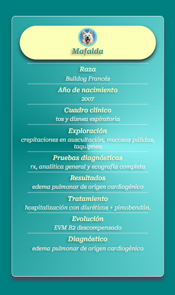
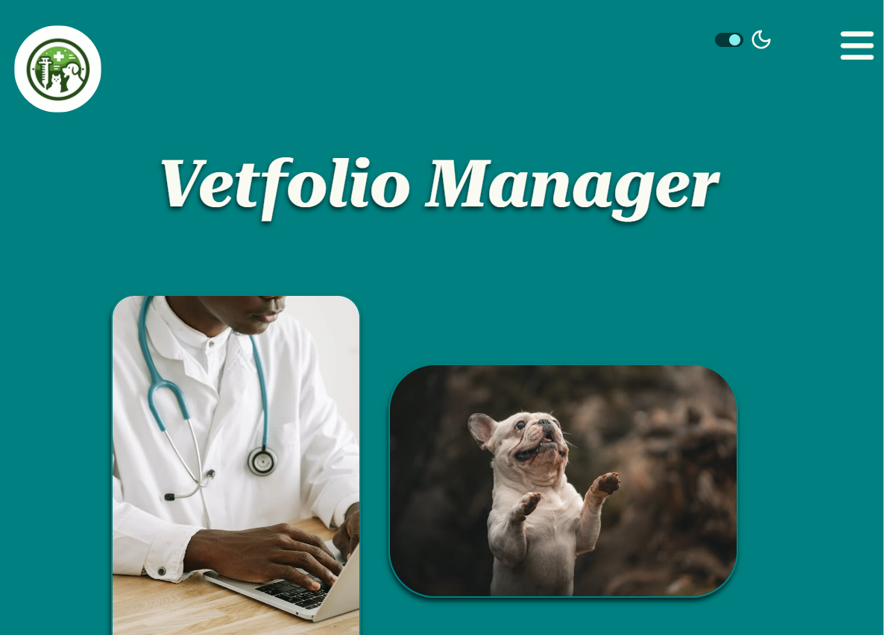
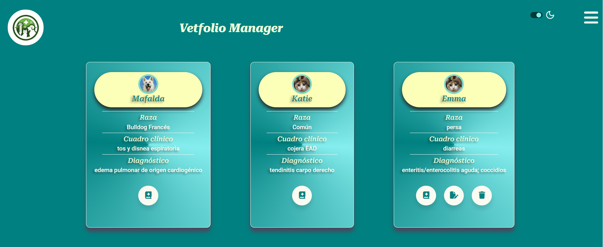

# Vetfolio Manager 👩🏻‍⚕️

Hola! Bienvenid@s a mi primer proyecto **Full Stack**, en el que he querido practicar todo lo aprendido durante el Bootcamp de Programación Web de Adalab. 

Esta aplicación web surge de mi aspiración por fusionar la tecnología con las demandas que surgen en la rutina diaria de los profesionales veterinarios de clínica. Esta iniciativa toma forma después de acumular 14 años de experiencia en este ámbito específico.


El proyecto comenzó sin utilizar ningún framework ni librería, y a medida que he ido adquiriendo nuevos conocimientos, lo he ido adaptando gradualmente. Actualmente, el frontend está desarrollado utilizando **ReactJS y SaSS**, mientras que el backend está construido con **Node.js, Express.js y MySQL**.


 ## Características principales  ☑️

Esta app está diseñada para veterinarios que desean llevar un registro de sus casos clínicos más relevantes, así como compartirlos públicamente con otros profesionales veterinarios.

1.  ***Registro de cuenta de usuario***: Los veterinarios pueden crear una cuenta personalizada para acceder a la aplicación.
2. ***Registro de casos clínicos***: Los usuarios pueden registrar y almacenar los detalles de los casos clínicos de sus pacientes, incluyendo síntomas, diagnósticos, tratamientos y notas adicionales.
3. ***Modo oscuro***: Toda la web puede cambiar de modo claro a modo oscuro seleccionando el icono correspondiente en el header, lo que hace la app más accesible.
4. ***Privacidad y compartición pública***: Los usuarios tienen la opción de mantener sus casos como privados o compartirlos públicamente en la plataforma para que otros veterinarios puedan consultarlos.
5. ***Búsqueda y filtrado de casos***  (en desarrollo): Los usuarios pueden buscar y filtrar casos clínicos por diversos criterios, como especie, diagnóstico o tratamiento. 
6. ***Modificación de sus registros***: Los usuarios registrados podrán realizar las modificaciones que deseen en cada uno de sus casos cuando lo necesiten.
7. ***Interacción social*** (en desarrollo): Los usuarios pueden comentar y calificar los casos clínicos compartidos por otros veterinarios, fomentando la interacción y el intercambio de conocimientos.


 ## Tecnologías utilizadas
***Frontend***: HTML, CSS, JavaScript (con framework React.js)
***Backend***: Node.js (con framework Express.js)
***Base de datos***: MySQL (MySQL Workbench)
***Autenticación y autorización***: JSON Web Tokens (JWT)
***Despliegue***: Render

## Maquetación 

Es un proyecto desarrollado con Sass y con diseño responsive:

**Mobile**




**Tablet/Desktop**






## Guía de uso rápido ✔️

Este proyecto ha sido desarrollado con React Starter Kit, que contiene una serie de herramientas pre-configuradas y pre-instaladas para optimizar y organizar el proyecto.

Para poder trabajar con él, tendrás que seguir los siguientes pasos:

- Clona este repositorio en tu local.

- Abre la terminal e instala las siguientes dependencias:


```
npm install

npm install node-sass

npm install react-router-dom
```

Una vez que han sido instaladas, podrás arrancar el proyecto escribiendo en la terminal el siguiente comando:

```
npm run dev
```
Hay que abrir la url generada con Ctrl + Click.


- Configura las variables de entorno. Copia el archivo .env.example a .env y proporciona los valores necesarios para DB_USER, DB_PASS, y PORT.

Asegúrate de tener un servidor MySQL en ejecución.

Ejecuta la aplicación:


```
npm start
```


## Contribución 💡

Agradezco feedback para poder seguir realizando mejoras y no dejar de aprender.

Muchas gracias por el tiempo dedicado!

 ## Licencia
Este proyecto está bajo licencia. Consulta el archivo LICENSE para más detalles.

## Autora  👩

[](
https://github.com/natlopar)


